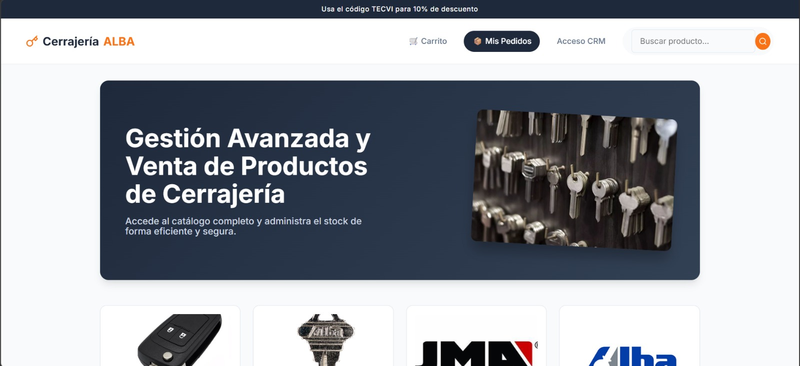
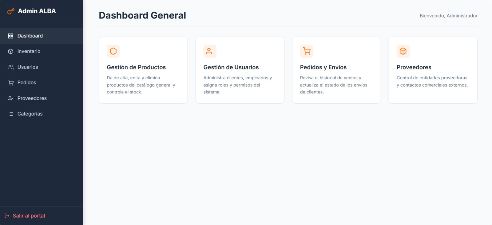
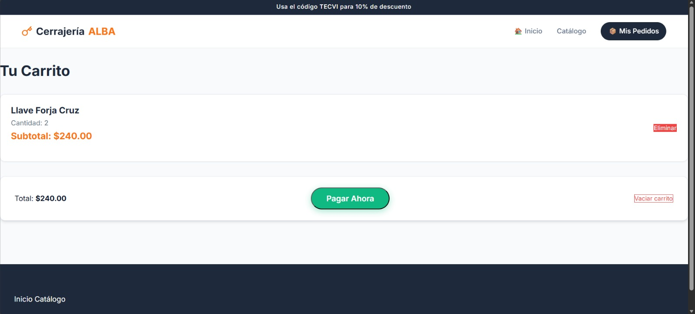

# CRM & Point of Sale - Cerrajeria Alba

> A custom digital solution built to modernize and scale operations for a local locksmith business.

---

## Project Objective

This project was developed to drive sales growth for a local locksmith business whose operations were limited to its immediate surroundings. By building this platform, we enabled the business to scale nationally, expanding its customer reach through an interactive digital catalog and a fully functional, secure internal CRM.

---

## Tech Stack & Architecture

* **Core Technologies:** HTML5, CSS3, and Vanilla JavaScript for a lightweight, highly responsive user interface.
* **Future Roadmap:** The system's modular architecture is designed for a seamless future migration to **Astro**, optimization of asset delivery, and enhanced SEO.
* **Backend & Database:** Node.js with Express.js managing a secure relational database. The environment was developed and tested locally using **XAMPP (phpMyAdmin)** for robust local testing, and migrated to **Supabase** cloud services for reliable production data storage and seamless scalability.

---

## Key Features

* **Interactive Catalog:** Customers can browse locksmith items, manage a real-time shopping cart, and place orders fluidly.
* **Admin Dashboard (CRM):** A secure internal panel for business owners to manage inventory levels (CRUD operations) and monitor incoming sales.
* **Role-Based Access Control (RBAC):** Secure separation of views and actions between public customers and authenticated store administrators.
---

## Platform Preview 

  
  
<em>The index of the CRM.</em>

  
  
<em>The main interface of the Admin view with the diferents options.</em>

  
  
<em>A one look up of the Shopping cart</em>

